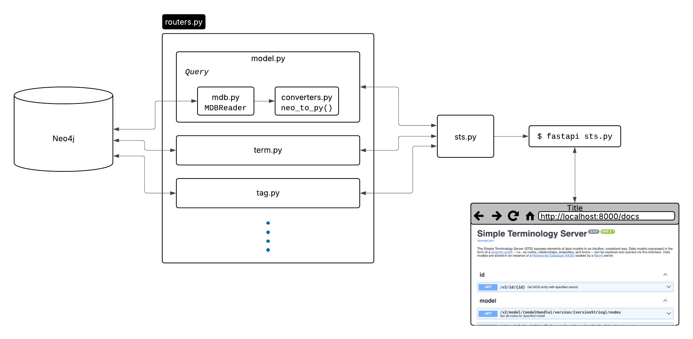

# bento-sts-fastapi Development Information

This is a rewrite of the [bento-sts](https://github.com/CBIIT/bento-sts) 
following the ticket DATATEAM-268. This lays out the following requirements:

* Remove web interface code and reduce to API only
* Replace Flask with [FastAPI](https://fastapi.tiangolo.com) as the coding framework
* Attempt to refactor so that we can create a drop-in replacement Docker image for 
  deployment (see https://github.com/CBIIT/bento-mdb/tree/main/devops/dockerfiles/sts)


## Getting started

### Set up working environment

To set up a local working environment:

[Get uv](https://docs.astral.sh/uv/#installation) and then run the following

```shell
git clone https://github.com/CBIIT/bento-sts-fastapi
cd bento-sts-fastapi
uv venv
uv pip install -e .
```

### Connect to or set up a running MDB

To configure a Neo4j MDB database that bento-sts will connect with, copy [env.eg](/env.eg)
to a file called `.env`, then edit that file to set the Bolt endpoint, username, and password
of a running database.

The easiest way to get a legit MDB running on your machine is 
to use Docker to run the image [maj1/test-mdb:neo4.4](https://hub.docker.com/layers/maj1/test-mdb/neo4.4/images/sha256-777659d5d2a3dfb7c6828cde37af3e9845d29445656eeeb63a19ae5ae1ea2121)
in a background container:

```shell
docker run -d -p 7474:7474 -p 7687:7687 --name test-mdb maj1/test-mdb:neo4.4
```

The container is running properly if you see it running:

```shell
docker ps
CONTAINER ID   IMAGE                  COMMAND                  CREATED         STATUS         PORTS                                                                                      NAMES
327f38a22cb6   maj1/test-mdb:neo4.4   "tini -g -- /startup…"   3 minutes ago   Up 3 minutes   0.0.0.0:7474->7474/tcp, [::]:7474->7474/tcp, 0.0.0.0:7687->7687/tcp, [::]:7687->7687/tcp   test-mdb
```

_and_ its logs show Neo4j started successfully:

```shell
docker logs test-mdb
2025-10-08 23:07:25.544+0000 INFO  ======== Neo4j 4.4.25 ========
...
2025-10-08 23:07:29.105+0000 INFO  name: system
2025-10-08 23:07:29.105+0000 INFO  creationDate: 2024-01-31T19:49:28.195Z
2025-10-08 23:07:29.105+0000 INFO  Started.
```

You shouldn't need to change anything in `.env` for bento-sts to connect successfully.

### Start a dev FastAPI server

Now you can start a dev server like so:

```shell
uv run fastapi dev src/bento_sts/sts.py
```

In a browser, go to http://127.0.0.1:8000/docs. If everything is working, you should see 
an interactive Swagger user interface that will list all the endpoints and allow queries.

The dev server will automatically reload as you change the code.

## Code Structure and Flow

At the top level directory are configuration files like `.env`, 
[pyproject.toml](/pyproject.toml), the virtual env created by uv (`.venv`), the [src](/src), and the [tests](/tests) subdirectory.


The code in [src/bento\_sts](/src/bento\_sts) is organized more or less as suggested
at [https://fastapi.tiangolo.com/tutorial/bigger-applications/](https://fastapi.tiangolo.com/tutorial/bigger-applications/):

    .
    ├── __init__.py
    ├── converters.py
    ├── dependencies.py
    ├── mdb.py
    ├── pymodels.py
    ├── routers
    │   ├── __init__.py
    │   ├── id.py
    │   ├── model.py
    │   ├── models.py
    │   ├── tag.py
    │   ├── tags.py
    │   └── terms.py
    └── sts.py



The [mdb.py](/src/bento_sts/mdb.py) provides a self-contained `MDBReader` class to perform
the actual Neo4j queries. The `bento-meta` dependency has been removed. `MDBReader` will
create a db connection using the environment variables set in `.env`. Run any read query
using the `get\_with\_statement()` method. The query result is returned as an array of
[Records](https://neo4j.com/docs/api/python-driver/6.0/api.html#neo4j.Record) as output by the [Neo4j python driver](https://neo4j.com/docs/api/python-driver/6.0/index.html).

The API endpoints and associated DB queries are organized in the files in the 
[routers](/src/bento_sts/routers) directory. The endpoints for `/models/...` are in 
[models.py](/src/bento_sts/models.py), the endpoints for `/tag/...` in 
[tag.py](/src/bento_sts/tag.py), and so on.

[sts.py](/src/bento_sts/sts.py) basically aggregates all these endpoints and defines the
API path to start with `/v2`.

[pymodels.py](/src/bento_sts/sts.py) defines all the [Pydantic data classes](https://docs.pydantic.dev/latest/concepts/models/#basic-model-usage)
that are used to standardize, validate, and JSON-serialize the API repsonse bodies.

[converters.py](/src/bento_sts/converters.py) define methods that convert Neo4j driverrecords 
to Pydantic data objects. There is one main method `neo_to_py` that should work for any type
of MDB graph node returned by a query. 

## Testing

We use [Pytest](https://docs.pytest.org/en/latest/index.html) for unit testing. Test files 
go in the [tests](/tests) directory. Look there for examples.

FastAPI provides a very convenient
[TestClient](https://fastapi.tiangolo.com/tutorial/testing/?h=run#using-testclient)
class for creating a client that just works. However, since STS needs
a backend Neo4j database to run, pytest fixtures are needed to either
mock the database endpoint or to spin up a real one.

The pytest db fixtures are defined in [conftest.py](/tests/conftest.py).

The current test code uses Docker to spin up the
[maj1/test-mdb:neo4.4]((https://hub.docker.com/layers/maj1/test-mdb/neo4.4/images/sha256-777659d5d2a3dfb7c6828cde37af3e9845d29445656eeeb63a19ae5ae1ea2121))
container as a fixture.  This takes some time when running tests. We
can add other options (e.g., just provide a url to a db that is
already up and running, a mock driver).

Ideally, every endpoint defined in the routers with have a corresponding test. See
[test\_id.py](/tests/test\_id.py) for an example.


